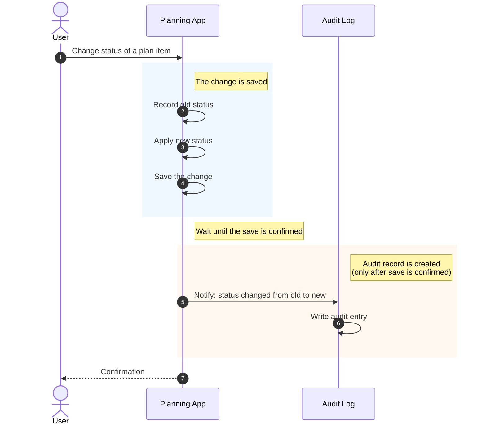

# intermediary

**A planning interface that restructures the repetitive human↔AI exchange.**

Working with AI assistants on real, ongoing projects means repeating yourself — re-explaining context, re-stating intentions, re-paraphrasing the same plan in slightly different words to get slightly different output. intermediary is a layer between you and the AI: humans interact through structured input (drag-and-drop into calendars, categories, status columns); AI consumes the same data as JSON over REST. One source of truth, two views, no re-explaining.

The architecture deliberately separates **intention** from **reality**. *PlanItems* model what you intend to do; *StudySessions* and *FitnessSessions* model what you actually did; *PlanEvents* are an append-only audit log of how intentions evolved between the two. The data model is the planning model.

This is an intermediary, not a chatbot wrapper. The AI doesn't live inside the app — it consumes the same REST endpoints any external client would. That separation is the point: the JSON contract is the API for *every* consumer, human-facing UI included.

## Status

**Phase 1 — the planning data layer — is complete:**

- **7 entities** with full REST CRUD covering certifications, job applications, documents, study and fitness sessions, plan items, and plan events
- **Event-driven audit logging** via Spring's `@TransactionalEventListener` (phase=AFTER_COMMIT) so audit entries only exist for changes that committed
- **Feature-based package organization** — each entity is a self-contained module
- **Containerized**: full stack starts with `docker-compose up`

**In progress:** JUnit + Testcontainers tests, `@ControllerAdvice` for structured error responses, OpenAPI documentation via springdoc.

**Phase 2:** Drag-and-drop frontend (Next.js + Tailwind), AWS deployment, microservices split with Kafka.

## How Audit Logging Works

When you change a plan item — say, marking it as done — the system not only
records the new state, it also records *that the change happened*. The audit
log is a separate, append-only history of every state transition, kept
deliberately apart from the plan items themselves. This gives you a queryable
record of how your intentions evolved over time.

Importantly, an audit entry is only created after the original change is
safely saved. If something goes wrong and the change is rolled back, no audit
entry is written. The audit log only tells the truth.



## Quick Start

Requires [Docker](https://www.docker.com/) and Git. No local Java or PostgreSQL needed.

```bash
git clone https://github.com/Duanysblist/intermediary.git
cd intermediary
docker-compose up
```

The API is available at `http://localhost:8080`. The database persists in a
Docker volume across restarts.

**Try it:**

```bash
# Create a plan item
curl -X POST http://localhost:8080/plan-items \
  -H "Content-Type: application/json" \
  -d '{"title":"Try this README","intent":"READ"}'

# Update its status — this triggers an automatic audit event
curl -X PUT http://localhost:8080/plan-items/1 \
  -H "Content-Type: application/json" \
  -d '{"title":"Try this README","intent":"READ","status":"DONE"}'

# View the audit log
curl http://localhost:8080/plan-events
```

To stop the stack: `docker-compose down`. To reset all data: `docker-compose down -v`.

## Tech Stack

**Backend:** Java 21, Spring Boot 3.5, Spring Data JPA, Hibernate, Jakarta Bean Validation, Lombok, Maven

**Data:** PostgreSQL 17

**Infrastructure:** Docker, Docker Compose, multi-stage Dockerfile

**Patterns:** Layered architecture, DTO/Mapper separation, polymorphic references, append-only audit logging, Spring Application Events with transactional listeners

**Planned (Phase 2+):** Next.js + Tailwind (frontend), Kafka, AWS deployment, Spring Security with JWT

## Key Patterns

### Feature-Based Package Organization

Each domain concept (Certification, Document, Application, etc.) is a self-contained
package containing its entity, repository, DTOs, mapper, service, and controller.
This contrasts with the more common layer-based organization (`/controllers`,
`/services`, `/repositories`) which scatters related code across the codebase.

Feature-based packaging keeps related code colocated, makes the codebase easier
to navigate at scale, and would simplify a future extraction to microservices —
each package is already its own bounded context.

### Intention vs Reality in the Data Model

The data model deliberately separates two concepts:

- **Intention** — what the user *plans* to do (PlanItem, with status and target date)
- **Reality** — what the user *actually did* (StudySession, FitnessSession)
- **History** — how intentions evolved over time (PlanEvent, append-only audit log)

This separation makes the system queryable along axes a unified model couldn't
support: "how often does what I plan match what I do?", "which intentions get
deferred most often?", "what did I actually study last month vs what I
intended to study?"

### Polymorphic References Without JPA Relationships

PlanItem can reference any other entity — a Certification it's studying for,
an Application it's preparing for, a Document it's drafting. Rather than
modeling these as JPA relationships (which would require either many nullable
foreign keys or a complex inheritance hierarchy), PlanItem uses a polymorphic
reference: a `ReferenceEntityType` enum plus a generic ID.

The tradeoff is no foreign key enforcement, but the flexibility lets the
planning model grow without schema migrations every time a new entity type is
added. The pattern is idiomatic in production systems — Rails has built-in
support via `polymorphic: true`, Django has Generic Foreign Keys.

### Event-Driven Audit Logging with Transactional Safety

State transitions on PlanItem automatically create immutable PlanEvent rows
via Spring's Application Events. `PlanItemService` publishes a
`PlanItemStatusChangedEvent`; `PlanEventListener` subscribes via
`@TransactionalEventListener(phase = AFTER_COMMIT)`. The two services never
import each other — coupling is one-way, through the event class only.

The `AFTER_COMMIT` phase ensures audit entries only exist for changes that
successfully committed. The listener calls a method annotated
`@Transactional(propagation = Propagation.REQUIRES_NEW)` to run the audit
write in a separate transaction — this is necessary because default
`REQUIRED` propagation silently fails in the AFTER_COMMIT phase by trying to
join a closed transaction.

## Roadmap

**Phase 1 (complete)** — Planning data layer. 7 entities with REST CRUD, event-driven audit logging, containerized deployment.

**Phase 1 polish (in progress)** — JUnit + Testcontainers tests, `@ControllerAdvice` for structured error responses, springdoc OpenAPI documentation, GitHub Actions CI.

**Phase 2** — Drag-and-drop frontend (Next.js + Tailwind), AWS deployment (ECS or EKS), Spring Security with JWT, microservices split using Kafka for inter-service events.

**Phase 3** — AI integration (the JSON contract becomes a Claude tool or MCP server), full plan-vs-reality analytics, mobile-friendly UI.