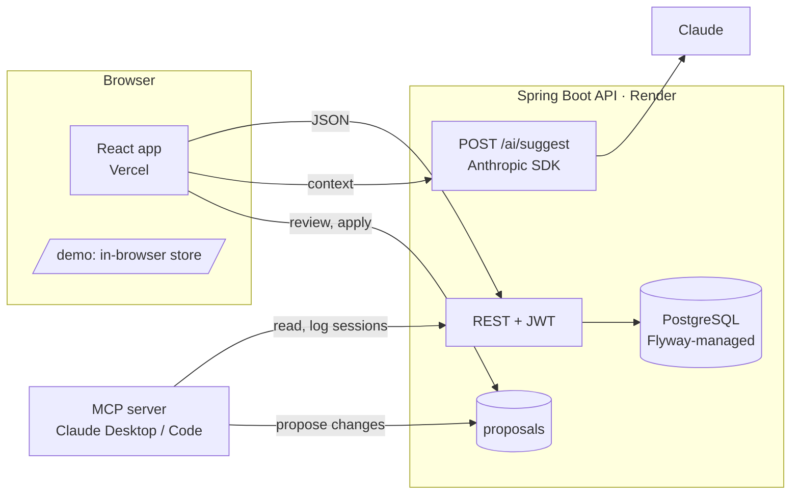

# intermediary

**A planning system that separates what you intend to do from what actually happened, and hands both to an AI without you re-explaining yourself.**

Working with AI assistants on real, ongoing projects means repeating yourself: re-explaining context, re-stating intentions, re-paraphrasing the same plan. intermediary sits between you and the assistant. You work through structured input (a board, a calendar week, session logs); the assistant reads the same data as JSON and answers with changes you review before anything is applied.

The data model is the planning model. **Plan items** are intentions: a title, an intent (study, exercise, apply, read, write), a status, an optional target date. **Study and fitness sessions** are reality: what happened, when, for how long, optionally linked back to the intention they fulfilled. **Plan events** are an append-only audit log of how each intention's status changed, written by the server on every transition. Everything else (certifications, applications, documents) is reference data an intention can point at.

## Live

| | |
|---|---|
| **App** | [intermediary-frontend.vercel.app](https://intermediary-frontend.vercel.app) (sign in) · [/demo](https://intermediary-frontend.vercel.app/demo) (sample data, no sign-in, nothing saved) |
| **API** | [intermediary-loxn.onrender.com/swagger-ui.html](https://intermediary-loxn.onrender.com/swagger-ui.html) (docs are public; calls need a sign-in token) |
| **Frontend repo** | [Duanysblist/intermediary-frontend](https://github.com/Duanysblist/intermediary-frontend) |

Both repos run CI on every push (backend tests with Testcontainers, Docker image build, MCP build; frontend lint, type-check, build) and deploy on merge to `main`.

## What it does

- **Plan.** A kanban board by status and a calendar week view. Drag to change status or date, or drop on the Unscheduled tray to clear the date. Every status change is recorded in the audit log.
- **Routines.** "Workout B every Mon, Wed, Fri" generates plan items for the coming weeks; generation is idempotent.
- **Log reality.** Study sessions (linked to a certification) and workouts, logged from the Sessions page or straight from a plan item card, which also marks the item done.
- **Review.** A weekly page comparing intention with reality: completion rate, planned versus done by intent, study minutes per certification, what slipped, which intentions get deferred most often.
- **Prompt.** Packages the data you choose, with a computed week summary, as Markdown plus JSON. Send it to Claude from the server, open it in claude.ai, or copy it anywhere. The reply comes back as a **change set** you review line by line before applying, and applied batches can be reverted for a week.
- **MCP server.** Claude Desktop or Claude Code can read the plan and log sessions directly, and any plan changes they suggest arrive as proposals in the app's inbox.
- **Calendar feed.** A subscribable iCalendar URL so dated intentions show up next to real appointments.
- **Single-account sign-in.** JWT auth with credentials from the environment.

## Architecture



The AI never lives inside the app. It is a client of the same REST API, and every change it suggests goes through the same review and the same endpoints as a manual edit, so the audit log stays honest.

### Key patterns

**Feature-based packages.** Each domain concept (`planitem`, `certification`, `proposal`, …) is a self-contained package with its entity, repository, DTOs, mapper, service and controller.

**Intention vs reality.** Plan items and sessions are separate tables joined only by an optional `planItemId` on the session. That makes questions like "how often does what I plan match what I do?" answerable without a unified model.

**Polymorphic references without JPA relationships.** A plan item points at any other record through `referenceEntityType` + `referenceEntityId`. No foreign keys, no inheritance hierarchy, no schema change when a new referenceable type appears.

**Event-driven audit log with transactional safety.** `PlanItemService` publishes a status-change event; a listener records it with `@TransactionalEventListener(phase = AFTER_COMMIT)` in a `REQUIRES_NEW` transaction, so an audit entry exists only for changes that actually committed. Clients cannot write plan events.

**Agents propose, humans apply.** The change-set contract (`ai/dto/ChangeSet`) is shared by the Claude endpoint, the MCP server, and the paste-import path in the frontend. The server stores proposals; the app applies them.

## API surface

Every endpoint except `POST /auth/login`, the OpenAPI docs and the token-protected calendar feed requires `Authorization: Bearer <token>`.

Collections with `GET`, `GET /{id}`, `POST`, `PUT /{id}` and `DELETE /{id}`: `/plan-items`, `/study-sessions`, `/fitness-sessions`, `/certifications`, `/applications`, `/documents`, `/recurring-plans`. `PUT` replaces the record: a missing or null field clears it.

| Endpoint | Purpose |
|---|---|
| `GET /plan-events?planItemId=` | Read the audit log. Written by the server only. |
| `POST /recurring-plans/generate?days=14` | Create plan items for every active routine on matching weekdays. Idempotent per routine and date. |
| `POST /proposals` · `GET /proposals?status=PENDING` · `PUT /proposals/{id}/status` | Change sets waiting for review. |
| `POST /ai/suggest` · `GET /ai/status` | Ask Claude for a change set (needs `ANTHROPIC_API_KEY`). |
| `GET /calendar/link` → `GET /calendar.ics?token=` | iCalendar feed of dated plan items. |
| `POST /auth/login` · `GET /auth/me` | Sign in; inspect the current token. |

The change-set shape, used everywhere a suggestion crosses a boundary:

```json
{
  "summary": "one or two sentences",
  "changes": [
    { "op": "update", "id": 12, "fields": { "targetDate": "2026-09-20", "status": "IN_PROGRESS" }, "reason": "why" },
    { "op": "update", "id": 7,  "fields": { "targetDate": "CLEAR" }, "reason": "take it off the calendar" },
    { "op": "create", "id": null, "fields": { "title": "New item", "intent": "STUDY", "targetDate": "2026-09-22" }, "reason": "why" }
  ]
}
```

## Tech stack

**Backend:** Java 21, Spring Boot 3.5, Spring Security (JWT, HS256), Spring Data JPA / Hibernate, Flyway, PostgreSQL 17, springdoc OpenAPI, Anthropic Java SDK, Lombok, Maven. Tests use JUnit 5, MockMvc and Testcontainers.

**Frontend:** React 19, TypeScript, Vite, Tailwind CSS 4, TanStack Query, React Router 7, dnd-kit.

**MCP server:** TypeScript, `@modelcontextprotocol/sdk`, stdio transport.

**Infrastructure:** multi-stage Dockerfile (unprivileged runtime user), docker compose for local dev, GitHub Actions, Render (API + managed PostgreSQL), Vercel (frontend).

## Running locally

Requires Docker Desktop and JDK 21. Everything else is fetched by the wrappers.

```bash
git clone https://github.com/Duanysblist/intermediary.git
cd intermediary
docker compose up --build
```

The API is on `http://localhost:8080` with sign-in `dev` / `dev`. Add the frontend with `docker compose --profile web up --build` (needs the frontend repo checked out beside this one) and open `http://localhost:3000`. To reset all data: `docker compose down -v`.

Copy `.env.example` to `.env` to override any default.

### In IntelliJ

Shared run configurations in `.run/` appear in the run dropdown:

| Run configuration | What it does |
|---|---|
| `IntermediaryApplication (testcontainers)` | Runs the app on a throwaway Testcontainers PostgreSQL. No compose needed; data is discarded on exit. |
| `DB (docker compose)` + `IntermediaryApplication (local)` | PostgreSQL in Docker, app from the IDE with breakpoints and devtools hot reload. |
| `All tests (JUnit)` / `Maven verify` | The test suite. Each test class starts its own PostgreSQL. |
| `Full stack (docker compose)` | Builds the image and runs app + DB in Docker. |

`http/api.http` has ready-made requests for the IntelliJ HTTP Client (sign in first; the token is stored automatically). The `intermediary@localhost` data source connects the Database tool window to the compose database.

### MCP server

```bash
cd mcp && npm install && npm run build
```

Then register `mcp/dist/index.js` with Claude Desktop or Claude Code, with the API URL and your credentials in its environment. Details in [mcp/README.md](mcp/README.md).

## Deploying

The API is a Docker image; set these variables wherever it runs. Anything secret has no default: an unset password or JWT secret becomes a random value printed in the log at startup.

| Variable | Purpose |
|---|---|
| `SPRING_DATASOURCE_URL`, `SPRING_DATASOURCE_USERNAME`, `SPRING_DATASOURCE_PASSWORD` | PostgreSQL connection. |
| `APP_USERNAME`, `APP_PASSWORD` | The single account. |
| `APP_JWT_SECRET` | At least 32 bytes (`openssl rand -base64 48`). Rotating it signs everyone out and changes the calendar feed link. |
| `APP_TOKEN_TTL_HOURS` | Sign-in lifetime. Default 72. |
| `APP_CORS_ORIGINS` | Comma-separated browser origins, e.g. the Vercel URL. |
| `ANTHROPIC_API_KEY` | Optional. Enables `POST /ai/suggest`. |
| `APP_AI_MODEL` | Optional. Default `claude-opus-5`. |

Schema changes are Flyway migrations in `src/main/resources/db/migration`; Hibernate only validates. Databases created before Flyway was introduced are baselined automatically at V1.

## Roadmap

- **Done:** planning data layer with REST CRUD, event-driven audit log, containerised deployment, OpenAPI docs, Testcontainers test suite, JWT sign-in, drag-and-drop frontend with a public demo, Claude round-trip with review and undo, routines, session-to-intention links, weekly review, proposals inbox, MCP server, calendar feed, Flyway, CI.
- **Next:** multi-user accounts, richer plan-vs-reality analytics, cross-field validation of polymorphic references.
- **Later:** microservices split with Kafka for inter-service events, AWS deployment.
