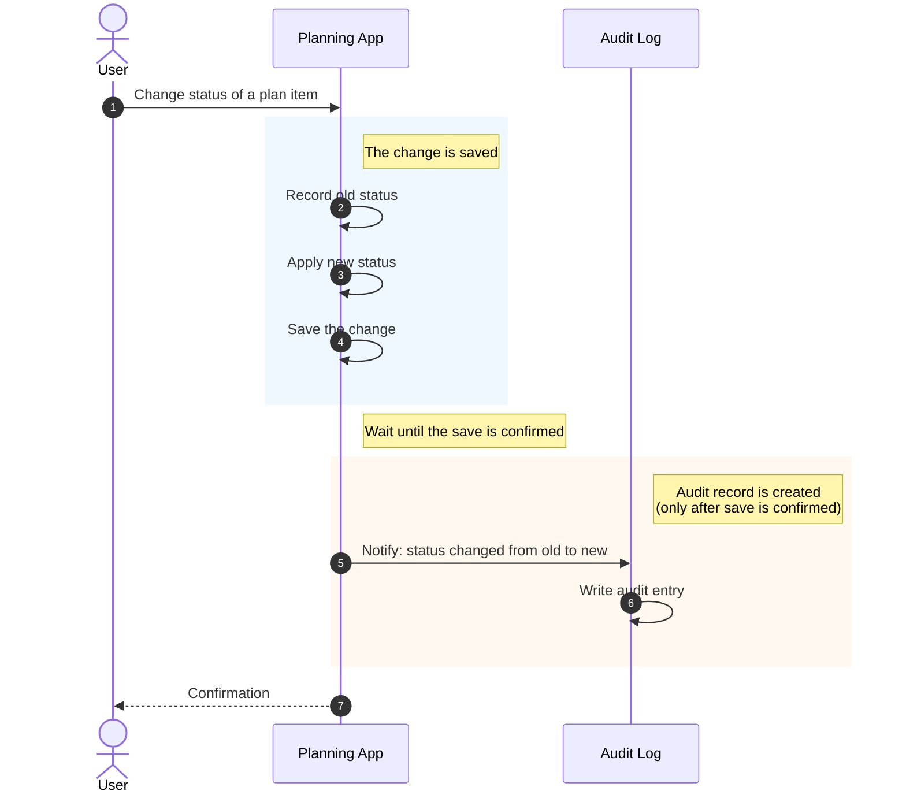

# intermediary

**A planning interface that restructures the repetitive human↔AI exchange.**

Working with AI assistants on real, ongoing projects means repeating yourself — re-explaining context, re-stating intentions, re-paraphrasing the same plan in slightly different words to get slightly different output. intermediary is a layer between you and the AI: humans interact through structured input (drag-and-drop into calendars, categories, status columns); AI consumes the same data as JSON over REST. One source of truth, two views, no re-explaining.

The architecture deliberately separates **intention** from **reality**. *PlanItems* model what you intend to do; *StudySessions* and *FitnessSessions* model what you actually did; *PlanEvents* are an append-only audit log of how intentions evolved between the two. The data model is the planning model.

This is an intermediary, not a chatbot wrapper. The AI doesn't live inside the app — it consumes the same REST endpoints any external client would. That separation is the point: the JSON contract is the API for *every* consumer, human-facing UI included.

## Live Demo

The API is deployed and live, with an interactive Swagger UI:

**Frontend:** [intermediary-frontend.vercel.app](https://intermediary-frontend.vercel.app) — sign in, or open [/demo](https://intermediary-frontend.vercel.app/demo) for a no-login walkthrough with sample data.

**API:** [https://intermediary-loxn.onrender.com/swagger-ui.html](https://intermediary-loxn.onrender.com/swagger-ui.html) (the docs are public; calls need a sign-in token)

Every endpoint is explorable in the browser — sign in via `POST /auth/login`, click **Authorize**, expand an operation, click
**Try it out**, and send a real request against the running service. No setup
required.

## Status

**Phase 1 — the planning data layer — is complete:**

- **7 entities** with full REST CRUD covering certifications, job applications, documents, study and fitness sessions, plan items, and plan events
- **Event-driven audit logging** via Spring's `@TransactionalEventListener` (phase=AFTER_COMMIT) so audit entries only exist for changes that committed
- **Feature-based package organization** — each entity is a self-contained module
- **Containerized**: full stack starts with `docker-compose up`

**Also done:** Testcontainers test suite, validation error handler, OpenAPI docs, JWT sign-in, Claude schedule suggestions, Flyway migrations, recurring plans, session-to-intention links, proposals inbox, iCalendar feed, MCP server, GitHub Actions CI.

**Phase 2 (in progress):** drag-and-drop frontend is live in [intermediary-frontend](https://github.com/Duanysblist/intermediary-frontend) (React + Vite + Tailwind). Remaining: AWS deployment, microservices split with Kafka.

## How Audit Logging Works

When you change a plan item — say, marking it as done — the system not only
records the new state, it also records *that the change happened*. The audit
log is a separate, append-only history of every state transition, kept
deliberately apart from the plan items themselves. This gives you a queryable
record of how your intentions evolved over time.

Importantly, an audit entry is only created after the original change is
safely saved. If something goes wrong and the change is rolled back, no audit
entry is written. The audit log only tells the truth.



## Quick Start

Requires [Docker](https://www.docker.com/) and Git. No local Java or PostgreSQL needed.

```bash
git clone https://github.com/Duanysblist/intermediary.git
cd intermediary
docker-compose up
```

The API is available at `http://localhost:8080`. The database persists in a
Docker volume across restarts.

**Try it:**

```bash
# Create a plan item
curl -X POST http://localhost:8080/plan-items \
  -H "Content-Type: application/json" \
  -d '{"title":"Try this README","intent":"READ"}'

# Update its status — this triggers an automatic audit event
curl -X PUT http://localhost:8080/plan-items/1 \
  -H "Content-Type: application/json" \
  -d '{"title":"Try this README","intent":"READ","status":"DONE"}'

# View the audit log
curl http://localhost:8080/plan-events
```

To stop the stack: `docker-compose down`. To reset all data: `docker-compose down -v`.

## Local Development (IntelliJ)

Prerequisites: [Docker Desktop](https://www.docker.com/products/docker-desktop/)
running, and JDK 21 (IntelliJ registers it as `ms-21`; `JAVA_HOME` should point
to it so `./mvnw` works from a terminal). The default dev credentials work out of
the box; to change them, copy `.env.example` to `.env` (gitignored).

Shared run configurations live in `.run/` and appear in the IntelliJ run
dropdown after opening the project:

| Run configuration | What it does |
|---|---|
| `DB (docker compose)` | Starts only PostgreSQL from `docker-compose.yml` (port 5432). |
| `IntermediaryApplication (local)` | Starts the DB container, then runs the app from the IDE on port 8080. Supports breakpoints and devtools hot reload. |
| `IntermediaryApplication (testcontainers)` | Runs the app against a throwaway Testcontainers PostgreSQL. No compose needed; data is discarded on exit. |
| `All tests (JUnit)` | Runs the test suite. Tests start their own PostgreSQL via Testcontainers. |
| `Full stack (docker compose)` | Builds the app image and runs app + DB in Docker, exactly like production. |
| `Maven verify` | `./mvnw clean verify` through IntelliJ. |

Explore and call the API from `http://localhost:8080/swagger-ui.html`, or open
`http/api.http` (IntelliJ HTTP Client; pick the `local` or `render` environment).

The IDE data source `intermediary@localhost` (Database tool window) connects to the
compose database with user `intermediary` / password `devpassword`; enter the
password once when prompted. The Endpoints tool window lists every controller
route and can generate HTTP Client requests for them.

## Deploying

The API runs anywhere the Docker image runs (it is live on Render). Set these environment
variables; the app refuses to fall back to known defaults for anything secret:

| Variable | Purpose |
|---|---|
| `SPRING_DATASOURCE_URL`, `SPRING_DATASOURCE_USERNAME`, `SPRING_DATASOURCE_PASSWORD` | PostgreSQL connection. |
| `APP_USERNAME`, `APP_PASSWORD` | The single account used to sign in. If `APP_PASSWORD` is unset a random one is generated and printed in the startup log. |
| `APP_JWT_SECRET` | At least 32 bytes (`openssl rand -base64 48`). If unset a random secret is used and every restart signs everyone out. |
| `APP_TOKEN_TTL_HOURS` | How long a sign-in lasts. Default 72. |
| `APP_CORS_ORIGINS` | Comma-separated browser origins allowed to call the API, e.g. the Vercel URL. |
| `ANTHROPIC_API_KEY` | Optional. Enables `POST /ai/suggest` (Claude-generated schedule changes). Leave unset to disable. |
| `APP_AI_MODEL` | Optional. Defaults to `claude-opus-5`. |

Every endpoint except `POST /auth/login` and the OpenAPI docs requires `Authorization: Bearer <token>`.
In Swagger UI, call `/auth/login`, then click **Authorize** and paste the token.

## Tech Stack

**Backend:** Java 21, Spring Boot 3.5, Spring Data JPA, Hibernate, Jakarta Bean Validation, Lombok, Maven

**Data:** PostgreSQL 17

**API Docs:** OpenAPI 3 / Swagger UI (springdoc)

**Infrastructure:** Docker, Docker Compose, multi-stage Dockerfile, Render (live deployment)

**Patterns:** Layered architecture, DTO/Mapper separation, polymorphic references, append-only audit logging, Spring Application Events with transactional listeners

**Frontend:** React 19 + Vite + Tailwind 4, TanStack Query, dnd-kit ([intermediary-frontend](https://github.com/Duanysblist/intermediary-frontend))

**Planned (Phase 2+):** Kafka, AWS deployment, Spring Security with JWT

## Key Patterns

### Feature-Based Package Organization

Each domain concept (Certification, Document, Application, etc.) is a self-contained
package containing its entity, repository, DTOs, mapper, service, and controller.
This contrasts with the more common layer-based organization (`/controllers`,
`/services`, `/repositories`) which scatters related code across the codebase.

Feature-based packaging keeps related code colocated, makes the codebase easier
to navigate at scale, and would simplify a future extraction to microservices —
each package is already its own bounded context.

### Intention vs Reality in the Data Model

The data model deliberately separates two concepts:

- **Intention** — what the user *plans* to do (PlanItem, with status and target date)
- **Reality** — what the user *actually did* (StudySession, FitnessSession)
- **History** — how intentions evolved over time (PlanEvent, append-only audit log)

This separation makes the system queryable along axes a unified model couldn't
support: "how often does what I plan match what I do?", "which intentions get
deferred most often?", "what did I actually study last month vs what I
intended to study?"

### Polymorphic References Without JPA Relationships

PlanItem can reference any other entity — a Certification it's studying for,
an Application it's preparing for, a Document it's drafting. Rather than
modeling these as JPA relationships (which would require either many nullable
foreign keys or a complex inheritance hierarchy), PlanItem uses a polymorphic
reference: a `ReferenceEntityType` enum plus a generic ID.

The tradeoff is no foreign key enforcement, but the flexibility lets the
planning model grow without schema migrations every time a new entity type is
added. The pattern is idiomatic in production systems — Rails has built-in
support via `polymorphic: true`, Django has Generic Foreign Keys.

### Event-Driven Audit Logging with Transactional Safety

State transitions on PlanItem automatically create immutable PlanEvent rows
via Spring's Application Events. `PlanItemService` publishes a
`PlanItemStatusChangedEvent`; `PlanEventListener` subscribes via
`@TransactionalEventListener(phase = AFTER_COMMIT)`. The two services never
import each other — coupling is one-way, through the event class only.

The `AFTER_COMMIT` phase ensures audit entries only exist for changes that
successfully committed. The listener calls a method annotated
`@Transactional(propagation = Propagation.REQUIRES_NEW)` to run the audit
write in a separate transaction — this is necessary because default
`REQUIRED` propagation silently fails in the AFTER_COMMIT phase by trying to
join a closed transaction.

## API Surface

All collections support `GET`, `GET /{id}`, `POST`, `PUT /{id}` (full replacement: a missing or
null field clears it) and `DELETE /{id}`: `/plan-items`, `/study-sessions`, `/fitness-sessions`,
`/certifications`, `/applications`, `/documents`, `/recurring-plans`. Plus:

| Endpoint | Purpose |
|---|---|
| `GET /plan-events?planItemId=` | Append-only status history (written by the server on every status change). |
| `POST /recurring-plans/generate?days=14` | Creates plan items for every active routine on matching weekdays; idempotent per routine and date. |
| `POST /proposals`, `GET /proposals?status=PENDING`, `PUT /proposals/{id}/status` | Change sets from agents, reviewed in the app before anything is applied. |
| `GET /calendar/link` → `GET /calendar.ics?token=` | iCalendar feed of dated plan items for Google/Apple/Outlook calendar. |
| `POST /ai/suggest`, `GET /ai/status` | Claude-generated change sets (needs `ANTHROPIC_API_KEY`). |
| `POST /auth/login`, `GET /auth/me` | JWT sign-in. |

Sessions carry an optional `planItemId` so reality can point back at the intention it fulfilled.
The schema is managed by Flyway (`src/main/resources/db/migration`); Hibernate only validates it.

## MCP Server

`mcp/` contains a Model Context Protocol server for Claude Desktop and Claude Code. It reads the
plan and logs sessions directly, and turns any suggested plan changes into a proposal you review
in the app. Setup in [mcp/README.md](mcp/README.md).

## Claude Integration

The AI is a client of the API, never part of it. Two paths, both ending in the same review step in the frontend:

- **Server-side:** `POST /ai/suggest` takes the same context block the frontend's Prompt page builds
  and calls Claude (Anthropic Java SDK, structured output constrained to the `ChangeSet` record in
  `ai/dto`). The response is a list of proposed plan-item updates and creations with reasons.
  Requires `ANTHROPIC_API_KEY`; `GET /ai/status` tells the frontend whether it is available.
- **Copy/paste:** the Prompt page asks any assistant for the same JSON shape, and the frontend imports it.

Nothing is applied server-side by the AI. The frontend shows each change as before → after; accepted
changes go through the ordinary `PUT /plan-items/{id}` and `POST /plan-items`, so the audit log records them.

## Roadmap

**Phase 1 (complete)** — Planning data layer. 7 entities with REST CRUD, event-driven audit logging, containerized deployment.
- **Containerized**: full stack starts with `docker-compose up`
- **Interactive API docs** via OpenAPI/Swagger (springdoc)
- **Deployed live** on Render with managed PostgreSQL

**Phase 1 polish** — JUnit + Testcontainers tests, `@ControllerAdvice` for validation errors, Flyway migrations, GitHub Actions CI: done.

**Phase 2 (in progress)** — Drag-and-drop frontend and JWT sign-in: done, see [intermediary-frontend](https://github.com/Duanysblist/intermediary-frontend) (board + week views, sessions, prompt builder). Still to do: AWS deployment (ECS or EKS), microservices split using Kafka for inter-service events.

**Phase 3 (in progress)** — AI integration: `POST /ai/suggest` with the review/import flow, an MCP server (`mcp/`) that proposes changes for review, and a weekly plan-vs-reality review in the frontend. Next: richer analytics, multi-user.